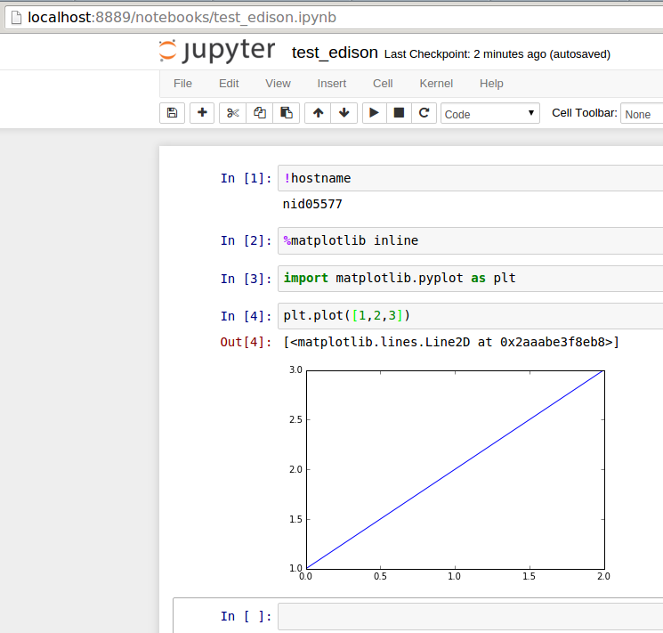

---
aliases:
- /2015/09/ipython-jupyter-notebook-nersc-edison.html
categories:
- jupyter
- python
- hpc
date: 2015-09-24 20:00
layout: post
slug: ipython-jupyter-notebook-nersc-edison
title: IPython/Jupyter notebook setup on NERSC Edison

---

## Introduction

This tutorial explains the setup to run an IPython Notebook on a computing node on the supercomputer Edison at NERSC and forward its port encrypted with SSH to the browser on a local laptop.
This setup is a bit more complicated than other supercomputers, i.e. see [my tutorial for Comet](http://zonca.github.io/2015/09/ipython-jupyter-notebook-sdsc-comet.html) for 2 reasons:

* Edison's computing nodes run a stripped down OS, with no support for SSH, unless you activate [Cluster Compatibility Mode](https://www.nersc.gov/users/computational-systems/hopper/cluster-compatibility-mode/) (CCM) 
* On edison you generally don't have direct access to a computing node, even if you request an interactive node you actually have access to an intermediary node (MOM node), from there `aprun` sends a job for execution on the computing node.

## Quick reference

* Install IPython notebook and make sure it is in the path, I recommend to install Anaconda 64bit in your home folder or on scratch.
* Make sure you can ssh passwordless within Edison, i.e. `ssh edison` from Edison  login node works without password
* Create a folder `notebook` in your home, get `notebook_job.pbs` and `launch_notebook_and_tunnel_to_login.sh` from <https://gist.github.com/zonca/357d36347fd5addca8f0>
* Change the port number and customize options (duration)
* `qsub notebook_job.pbs`
* From laptop, launch `bash tunnel_laptop_edisonlogin.sh ##` from <https://gist.github.com/zonca/5f8b5ccb826a774d3f89>, where `##` is the edison login number in 2 digits, like `03`. First you need to modify the port number.
* From laptop, open browser and connect to `http://localhost:YOURPORT`

## Detailed walkthrough

### One time setup on Edison

Make sure that `ipython notebook` works on a login node, one option is to install 
Anaconda 64bit from http://continuum.io/downloads#py34. Choose Python 3.

You need to be able to SSH from a node to another node on Edison with no need of a password. Create a new SSH certificate with `ssh-keygen`, hit enter to keep all default options, DO NOT ENTER A PASSWORD. Then use `ssh-copy-id edison.nersc.gov`, enter your password to make sure the key is copied in the authorized hosts.
Now you can check it works by executing:

    ssh edison.nersc.gov
    
from the login node and make sure you are NOT asked for your password.

### Configure the script for TORQUE and submit the job

Create a `notebook` folder on your home on Edison.

Copy `notebook_job.pbs` and `launch_notebook_and_tunnel_to_login.sh` from <https://gist.github.com/zonca/357d36347fd5addca8f0> to the `notebook` folder.

Change the port number in the `launch_notebook_and_tunnel_to_login.sh` script to a port of your choosing between 7000 and 9999, referenced as YOURPORT in the rest of the tutorial. Two users on the same login node on the same port would not be allowed to forward, so try to avoid common port numbers as 8000, 9000, 8080 or 8888.

Choose a duration of your job, for initial testing better keep 30 minutes so your job starts sooner.

Submit the job to the scheduler:

    qsub notebook_job.pbs
    
Wait for the job to start running, you should see `R` in:

    qstat -u $USER
    
The script launches an IPython notebook on a computing node and tunnels its port to the login node.

You can check that everything worked by checking that no errors show up in the `notebook.log` file, and that you can access the notebook page with `wget`:

    wget localhost:YOURPORT

should download a `index.html` file in the current folder, and NOT give an error like "Connection refused".

### Tunnel the port to your laptop

#### Linux / MAC

Download the `tunnel_laptop_edisonlogin.sh` script from <https://gist.github.com/zonca/357d36347fd5addca8f0>.

Customize the script with your port number and your username.

Launch `bash tunnel_laptop_edisonlogin.sh ##` where `##` is the Edison login node you launched the job from in 2 digits, e.g. `03`.

The script forwards the port from the login node of Edison to your laptop.

#### Windows

Install `putty`.

Follow tutorial for local port forwarding on <http://howto.ccs.neu.edu/howto/windows/ssh-port-tunneling-with-putty/>

* set `edison##-eth5.nersc.gov` as remote host, where `##` is the Edison login node you launched the job from in 2 digits, e.g. `03` and set 22 as SSH port
* set YOURPORT as tunnel port, replace both 8080 and 80 in the tutorial with your port number. 

### Connect to the Notebook

Open a browser and type `http://localhost:YOURPORT` in the address bar.

See in the screenshot from my local browser, the `hostname` is one of Edison's computing node:

## Acknowledgements

Thanks Lisa Gerhardt from NERSC user support to help me understand Edison's configuration.
