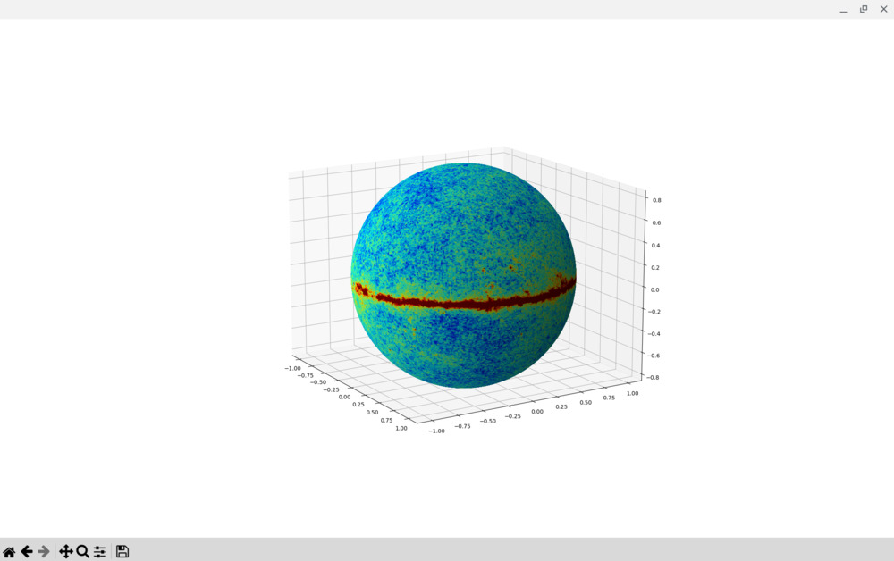

---
categories:
- python
- astrophysics
date: 2024-05-20
layout: post
slug: interactive-3d-plot-planck-map
title: Interactive 3D plot of a Planck map with Matplotlib

---

This is an update of my [older tutorial](./2013-03-12-interactive-3d-plot-of-sky-map.md)

Unfortunately I was not able to make Mayavi properly plot the data, rerunning the same code would give a map that looked like uniform noise.

This test instead uses matplotlib, unfortunately this is extremely slow, and the output map is really slow to rotate or interact at all.
Anyway it is possible to tweak `xsize`,`ysize` to change the resolution as a trade-off between resolution and interactivity.

