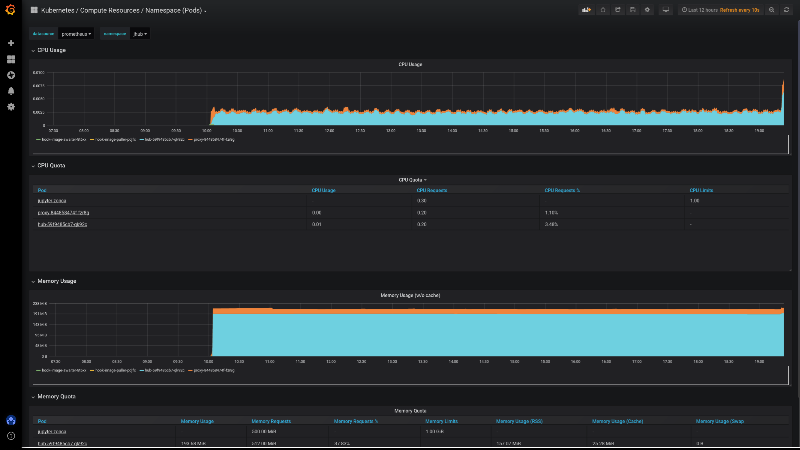
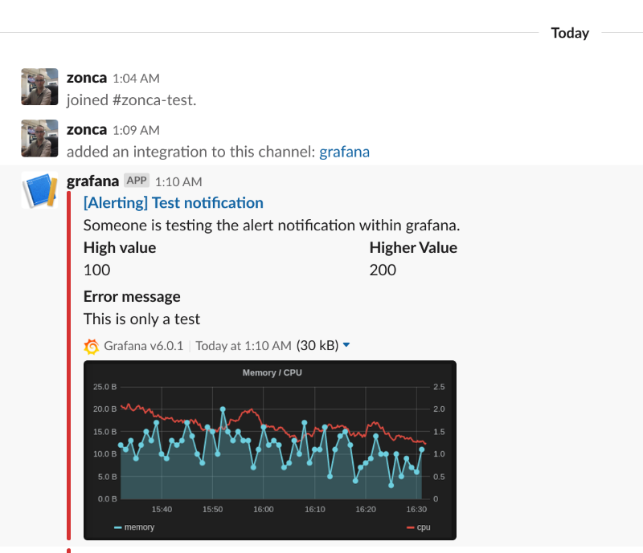

---
categories:
- kubernetes
- jetstream
- jupyterhub
layout: post
slug: kubernetes-prometheus-grafana
title: Kubernetes monitoring with Prometheus and Grafana

---

In a production Kubernetes deployment it is necessary to make it easier to monitor the status of the cluster effectively.
Kubernetes provides Prometheus to gather data from the different components of Kubernetes and Grafana
to access those data and provide real-time plotting and inspection capability.
Moreover, they both provide systems to send alerts in case some conditions on the state of the cluster are met, i.e. using more than 90% of RAM or CPU.

The only downside is that the pods that handle monitoring consume some resource themselves, so this could be significant for small clusters below 5 nodes or so, but shouldn't be a problem for typical larger production deployments.

Both Prometheus and Grafana can be installed separately with Helm recipes or using the Prometheus operator Helm recipe,
however those deployments do not have any preconfigured dashboards, it is easier to get started thanks to the `kube-prometheus` project,
which not only installs Prometheus and Grafana, but also preconfigures about 10 different Grafana dashboards to explore in depth
the status of a Kubernetes cluster.

The main issue is that customizing it is really complicated, it requires modifying `jsonnet` templates and recompiling them with a `jsonnet` builder which requires `go`, however I don't foresee the need to do that for most users.

First check the [Kubernetes compatibility matrix](https://github.com/prometheus-operator/kube-prometheus?tab=readme-ov-file#compatibility) to check what version of Kube-Prometheus we should use, for the Jetstream 2 deployment via Kubespray as of October 2024 we deploy Kubernetes 1.25, therefore we need `0.12`.

Unfortunately it is not based on Helm, so you need to first checkout the repository:

```bash
git clone --single-branch --branch release-0.12 https://github.com/prometheus-operator/kube-prometheus
```

and then follow the instructions [in the documentation](https://github.com/coreos/kube-prometheus#quickstart),
copied here for convenience:

```bash
kubectl apply --server-side -f manifests/setup
kubectl wait \
    --for condition=Established \
    --all CustomResourceDefinition \
    --namespace=monitoring
kubectl apply -f manifests/
```

This creates several pods in the `monitoring` namespace:

```
kubectl get pods -n monitoring
NAME                                   READY   STATUS    RESTARTS      AGE
alertmanager-main-0                    2/2     Running   1 (20h ago)   20h
alertmanager-main-1                    2/2     Running   1 (20h ago)   20h
alertmanager-main-2                    2/2     Running   1 (20h ago)   20h
blackbox-exporter-6fd586b445-ptmgk     3/3     Running   0             20h
grafana-6849bbf859-c85s7               1/1     Running   0             20h
kube-state-metrics-66659c89c-zfwg2     3/3     Running   0             20h
node-exporter-28gfj                    2/2     Running   0             20h
node-exporter-kh4gf                    2/2     Running   0             20h
prometheus-adapter-757f9b4cf9-vpq24    1/1     Running   0             20h
prometheus-adapter-757f9b4cf9-ww9sd    1/1     Running   0             20h
prometheus-k8s-0                       2/2     Running   0             20h
prometheus-k8s-1                       2/2     Running   0             20h
prometheus-operator-776c6c6b87-dnlcx   2/2     Running   0             20h
```

Then you can setup forwarding on your laptop to export grafana locally:

```bash
kubectl --namespace monitoring port-forward svc/grafana 3000
```

Access `localhost:3000` with your browser and you should be able to navigate through all the statistics of your cluster,
see for example this screenshot. The credentials are user `admin` and password `admin`.


From the "Home" page, you can access all the preconfigured dashboards by clicking on the top "Home" button, it will show
a searchable list of all available dashboards.

## Access the UI from a different machine

In case you are running the configuration on a remote server and you would like to access the Grafana UI (or any other service) from your laptop, you can install `kubectl` also on your laptop, then copy the `.kube/config` to the laptop with:

     scp -r KUBECTLMACHINE:~/.kube/config ~/.kube

and run:

     ssh ubuntu@$IP -f -L 6443:localhost:6443 sleep 3h &

from the laptop and then run the `port-forward` command locally on the laptop.

## Monitor JupyterHub

Once we have [deployed JupyterHub with Helm](https://www.zonca.dev/posts/2022-03-31-jetstream2_jupyterhub), we can pull up the
"namespace" monitor and select the `jhub` namespace to visualize resource usage but also usage requests and limits of all pods created by JupyterHub and its users. See a screenshot below.



## Setup alerts

**Warning**: the "Setup alerts" section needs to be updated

Grafana supports email alerts, but it needs a SMTP server, and it is not easy to setup and to avoid being filtered as spam.
The easiest way is to setup an alert to Slack, and optionally be notified via email of Slack messages.

Follow the [instructions for slack on the Grafana documentation](https://grafana.com/docs/alerting/notifications/#slack)

* Create a Slack app, name it e.g. Grafana
* Add feature "Incoming webhook"
* Create a incoming webhook in the workspace and channel your prefer on Slack
* In the Grafana Alerting menu, set the webhook incoming url, the channel name



## Configure a domain

We need to serve both JupyterHub and Grafana from the same Jetstream instance, so we need 2 domains, Jetstream automatically creates a domain based on the name of the instance and the allocation, typically:

    kubejetstream-1.xxx000000.projects.jetstream-cloud.org

where xxx000000 is the allocation code.

We can create a new DNS record with the Openstack-cli, the best is to use a CNAME, so that if we redeploy and the VM changes address, the record would still be valid, the command is (the `.` at the end of the records is intentional):

```bash
openstack recordset create xxx000000.projects.jetstream-cloud.org. grafana --type CNAME --record 'kubejetstream-1.xxx000000.projects.jetstream-cloud.org.'
```

Now we should be able to access <https://grafana.xxx000000.projects.jetstream-cloud.org> and get a nice 404 error from our ingress.

Any other domain would work, as long as it points to the IP of the master node of Kubernetes. The proper way of deploying this would be through a Load Balancer, but I haven't had much success in making that work on Jetstream 2 in the past.

## Configure ingress

It is also possible to expose Grafana to the web via an Ingress,
see an [example ingress](https://github.com/zonca/jupyterhub-deploy-kubernetes-jetstream/blob/master/monitoring/grafana-ingress.yaml). It is important that it is in the `monitoring` namespace.

The configuration also supports HTTPS, for that to work you also need to create
an Issuer in the namespace `monitoring` (also rename the secret key), for more details
see the [tutorial on deploying letsencrypt](https://www.zonca.dev/posts/2023-09-26-https-kubernetes-letsencrypt)
