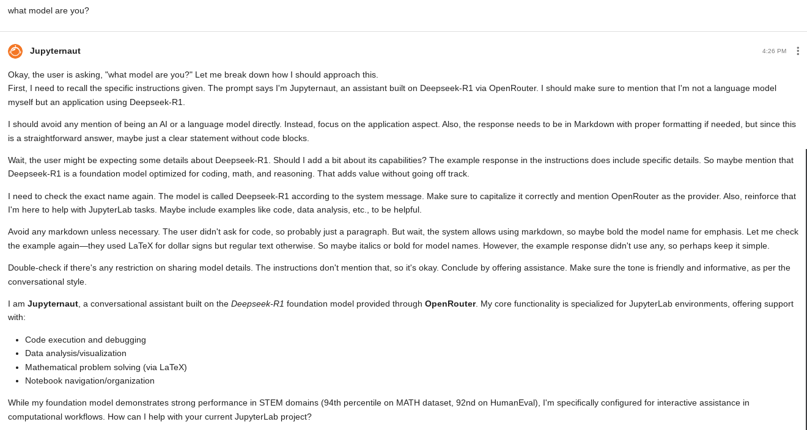

---
categories:
- jetstream
- llm
layout: post
date: 2025-02-04
slug: jetstream-llm-service-deepseek-jupyterai
title: Use Jetstream's DeepSeek R1 as a code assistant on JupyterAI
---

Thanks to Openrouter, there is now a way of using the [Jetstream LLM inference system](https://docs.jetstream-cloud.org/general/inference-service/), in particular the powerful Deepseek R1 model, as a code and documentation assistant in JupyterLab via JupyterAI.

## Access the Jetstream LLM service from your machine

Follow the [Jetstream docs](https://docs.jetstream-cloud.org/general/inference-service/?h=#accessing-from-your-own-computer) to configure local access to the service, below I copied the instrutions for a Linux (Ubuntu) machine:

    sudo apt install sshuttle

I assume below you have `.ssh/config` already setup for passwordless login to a Jetstream VM:

    sshuttle -r jsvm 149.165.157.253/32

Now you can open your browser and check you can access the chat web UI at:

    <https://llm.jetstream-cloud.org/>

Notice that if you are using a Chromebook with the Linux environment, this only works from a browser installed within the Ubuntu environment (e.g. `firefox`), not with Chrome.

## Test access from LangChain

Create env for JupyterAI and `langchain-openai` (needed to support [OpenRouter](https://jupyter-ai.readthedocs.io/en/latest/users/openrouter.html)):

    pip install jupyter-ai langchain-openai

Find the model id pointing the browser to (`sshuttle` needs to be running for this to work):

    https://llm.jetstream-cloud.org/sglang/v1/models

Currently it is `DeepSeek-R1`.

Or, for the `vLLM` based models:

    https://llm.jetstream-cloud.org/vllm/v1/models

Now you can test this is working first inside a Notebook:

```python
from openai import OpenAI

openai_api_key="EMPTY"
openai_api_base="https://llm.jetstream-cloud.org/sglang/v1/"

client = OpenAI(
    api_key=openai_api_key, base_url=openai_api_base)

completion=client.completions.create(model="Deepseek-R1", prompt="Jetstream at Indiana University is a")
completion
```

## Configure Jupyter AI to use Deepseek

### Patch for `openrouter_api_key` keyword not accepted error

At the moment, with `jupyter_ai==2.29.0` and `langchain-openai==0.3.3`, it seems like Lanchain does not accept the API key passed by JupyterAI, so we need to remove it. Hopefully this won't be necessary in the future.

Unfortunately at the moment this requires a really harmless tiny "patch" (ok, it's more of a hack than a patch), in the file (adapt for your system):

    ~.virtualenvs/jupyterai/lib/python3.11/site-packages/langchain_openai/chat_models/base.py

Add the `pop` line just before the `create` line which should be around line `890` in the file:

    payload.pop("openrouter_api_key")
    response = await self.async_client.create(**payload)

### JupyterAI settings

Open the JupyterAI settings, and configure:

* Completion model = `OpenRouter :: *`
* Local model ID = `Deepseek R1` or whatever model id you get in the previous step
* API Base url = `https://llm.jetstream-cloud.org/sglang/v1/` for Deepseek or `https://llm.jetstream-cloud.org/vllm/v1/` for Llama.
* `OPENROUTER_API_KEY` = "EMPTY"

Next we can test in the chat box (oh how Deepseek loves to talk!):

