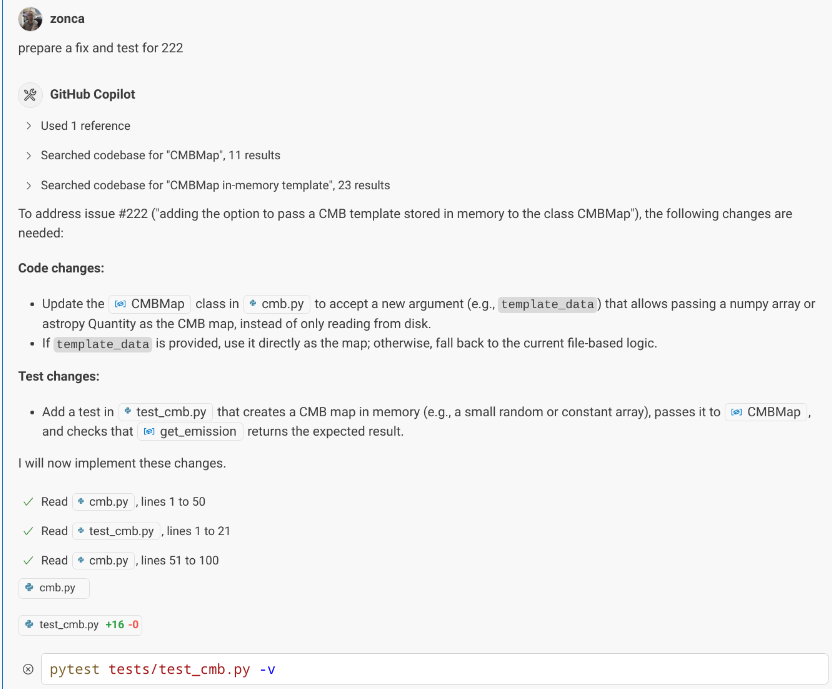

Visual Studio Code, together with GitHub Copilot in agent mode, enables a more focused and efficient development workflow. Below are three practical examples of how this integration can help streamline your daily work, each illustrated with real screenshots:

## 1. Directly Addressing GitHub Issues from VS Code

You can point Copilot agent mode to a specific GitHub issue and ask it to prepare a fix. The agent will analyze the issue, propose a solution, and even split your changes into logical commits with clear messages. This makes it easy to keep your work organized and directly linked to the issues you are addressing. Learn more about the underlying Model Context Protocol at the [GitHub MCP Server repository](https://github.com/github/github-mcp-server).

## 2. Debugging

Copilot agent mode can access test failures and error messages directly from your workspace, so you do not need to copy and paste errors into the chat. The agent can also temporarily insert print statements into your code to help diagnose issues, and then remove them once the problem is understood. This approach supports a more natural debugging workflow, letting you focus on the code rather than on context switching.

## 3. Git Workflow Support and Automation

Routine git operations—such as staging files, running tests, and confirming fixes—are handled smoothly by Copilot agent mode. The agent provides context-aware suggestions and explanations, helping you maintain a clean and reliable version history with minimal manual intervention.

