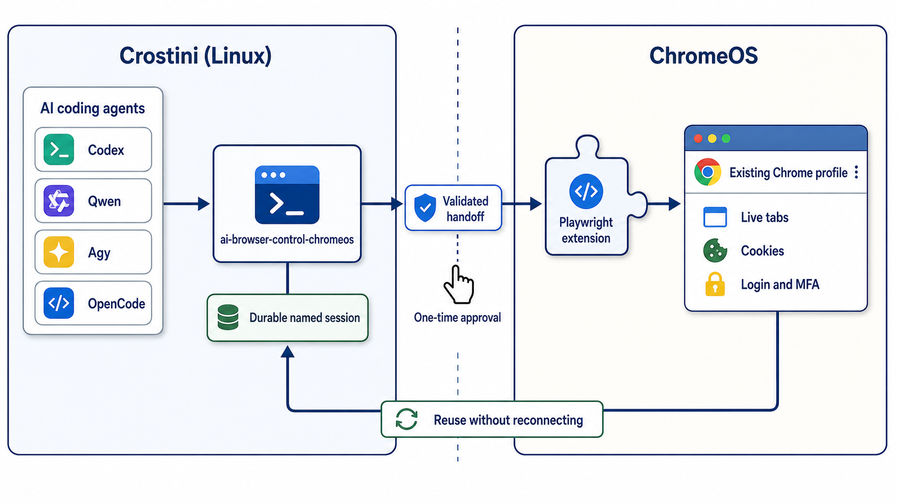

AI coding agents running inside a Chromebook's Crostini Linux container can easily launch a
separate Linux browser, but that loses the tabs, cookies, and authenticated sessions already
present in the normal ChromeOS Chrome profile.

I wanted the useful experience of `claude --chrome`, but not tied to one agent. I wanted Codex,
Qwen Code, Agy, OpenCode, and other coding agents to share the same safe browser-control workflow.

The original direct Playwright-extension approach was unreliable. Short-lived agent shell calls
killed the relay. Retrying created multiple Connect tabs, malformed handoffs caused "Missing
mcpRelayUrl parameter in URL", and stale pages produced "Failed to connect to MCP relay:
WebSocket error".

The key design decision was one durable named Playwright session supervised in Crostini. Every
agent command checks its state first and reuses it. The user performs one browser UI handoff and
handles login or MFA. The agent owns every terminal process, status check, log inspection, retry,
and browser command.

This makes the workflow both more reliable and easier for a person to use. The user should never
be asked to babysit a terminal command or repeatedly paste stale connection addresses.

## Architecture

* AI agent in Crostini
* ai-browser-control-chromeos wrapper
* durable named session and supervisor
* locally validated handoff
* official Playwright Chrome extension
* existing ChromeOS Chrome profile with live tabs, cookies, login, and MFA
* status first, connect only when disconnected, wait while connecting, verify before declaring
  readiness
* verify runs tab-list and snapshot in separate fresh Playwright CLI processes, proving reuse
  across process boundaries
* malformed and stale handoffs are rejected or recovered by state, not blind retry

<figure>
  
  <figcaption>Architecture of the AI Browser Control for ChromeOS</figcaption>
</figure>

## Installation

```bash
git clone https://github.com/zonca/ai-browser-control-chromeos.git
cd ai-browser-control-chromeos
./scripts/setup.sh
```

Setup checks Node.js, npm, Python, and garcon-url-handler. It installs `@playwright/cli` and the
wrapper, stores the extension token outside the repository with mode 600, and links the skill
under `~/.agents/skills`. It is designed to work with the official [Playwright Extension for Chrome](https://chromewebstore.google.com/detail/playwright-extension/mmlmfjhmonkocbjadbfplnigmagldckm).

## Human handoff

1. Install the extension in ChromeOS Chrome.
2. Enter its token only through `setup.sh`'s hidden prompt, never in an AI chat.
3. The agent starts one connection.
4. In the newest Connect tab, click Copy browser connection address, paste it into Chrome's
   address bar, and press Enter.
5. The agent waits, verifies, and continues. The human handles login and MFA only when needed.

If you are using OpenCode, please note the discovery caveat from the README: if a release does
not follow the `~/.agents/skills` symlink, add the checkout as an explicit `skills.paths` entry.
Refer to the README for the complete runbook and troubleshooting details.

## Compatibility evidence

The setup works across multiple agents. On 2026-07-28, the same command-free natural-language
prompt passed:

* [OpenCode 1.17.18 with GLM 5.2](https://github.com/zonca/ai-browser-control-chromeos/blob/main/artifacts/opencode-glm-5.2-2026-07-28/test-report.md)
  (8/8 assertions)
* [Qwen Code 0.20.0 with qwen3-small](https://github.com/zonca/ai-browser-control-chromeos/blob/main/artifacts/qwen-code-qwen3-small-2026-07-28/test-report.md)
  (8/8 assertions)
* [Agy 1.1.8 with its managed default model](https://github.com/zonca/ai-browser-control-chromeos/blob/main/artifacts/agy-2026-07-28/test-report.md)
  (8/8 assertions after one improvement)

The Agy finding shows why cross-agent testing matters. Agy first returned a token-redacted URL
that still contained the local relay port and session identifier. The skill was tightened to
strip the entire query string and fragment from extension connection URLs. A fresh Agy run then
passed all assertions.

## Security and scope

* The extension token stays outside git and has permission mode 600.
* Logs redact the token.
* Published test transcripts are sanitized.
* The attached browser has the signed-in user's privileges, so agents must stay within the
  user's authorized scope and require approval for consequential writes.
* The user, not the agent, enters passwords and completes MFA.
* The implementation is intentionally ChromeOS/Crostini specific. The broader durable-session and
  state-machine pattern can apply elsewhere, but the URL handoff and existing-profile bridge
  target ChromeOS.

To try the skill or report agent-specific compatibility issues, please visit the public
[repository](https://github.com/zonca/ai-browser-control-chromeos). The repository is MIT
licensed.
