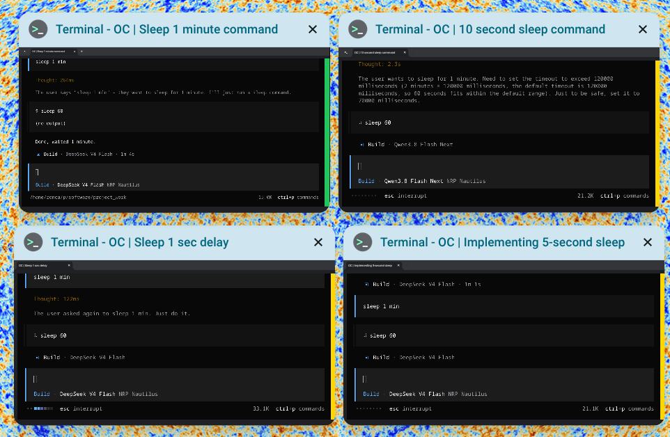

---
categories:
- linux
- tools
- ai
date: '2026-09-13 12:00:00'
layout: post
slug: agent-terminal-status-chromeos-overview
title: See if your opencode session is still working in ChromeOS Overview
---

Running opencode in a ChromeOS Crostini terminal, you have to keep switching back to the window to know if the agent is still working. Desktop notifications only tell you when something finishes. This post shows how to color-code the terminal window's right edge so ChromeOS Overview tells you at a glance whether opencode is still busy: a thin colored bar appears on the right of the window.



## How it works

ChromeOS terminals use hterm, which supports two escape sequences:

- `OSC 11` sets the default background color
- `OSC 111` resets it to the terminal default

The opencode TUI paints its own dark screen, so the terminal background only shows through on the right margin of the window. That margin becomes the status bar: gold while the session is busy, green when the session becomes idle. In ChromeOS Overview the bar is clearly visible on the thumbnail, so you can scan all your opencode windows without switching to them.

## Install the helper

A small bash script, `agent-state`, writes the right escape sequence to the host terminal. opencode runs hooks inside a server process that has no terminal attached, so the helper walks up the process tree to find the tty that launched the terminal window. The script is available in the [gist](https://gist.github.com/zonca/900fa78ad943a971485d1affad82f291):

```bash
curl -fsSL https://gist.githubusercontent.com/zonca/900fa78ad943a971485d1affad82f291/raw/agent-state -o ~/.local/bin/agent-state
chmod +x ~/.local/bin/agent-state
```

Usage: `agent-state <working|done|waiting|error|reset> [agent-name]`. Colors are configurable through `AGENT_STATE_WORKING_COLOR`, `AGENT_STATE_DONE_COLOR`, and `AGENT_STATE_ERROR_COLOR`.

The full source of `agent-state` and the opencode plugin are in this GitHub Gist:

<script src="https://gist.github.com/zonca/900fa78ad943a971485d1affad82f291.js"></script>

## Install the opencode plugin

opencode loads plugins from `~/.config/opencode/plugins/`. Copy the second file of the gist, `agent-status.js`, into that directory, then restart opencode:

```bash
curl -fsSL https://gist.githubusercontent.com/zonca/900fa78ad943a971485d1affad82f291/raw/agent-status.js -o ~/.config/opencode/plugins/agent-status.js
mkdir -p ~/.config/opencode/plugins
```

The plugin listens to session events: while a session is busy the bar is gold, when it goes idle the bar turns green, and on a session error the bar turns red.

## Reset the background when you quit opencode

When opencode exits, the shell takes over the window and the colored background would cover the whole terminal. Add a wrapper to `~/.bashrc` so opencode resets the background when it quits:

```bash
opencode() { command opencode "$@"; agent-state reset; }
```

## Test it

1. Restart opencode (so the plugin loads).
2. Give it a task that takes a while, for example: `Run "sleep 15 && echo done" in your terminal.`
3. Open ChromeOS Overview: the bar is gold while opencode works, and turns green when the session is idle again.
4. Quit opencode: the window returns to the default black background.

The same helper can be wired to other agent CLIs through their own lifecycle hooks.
