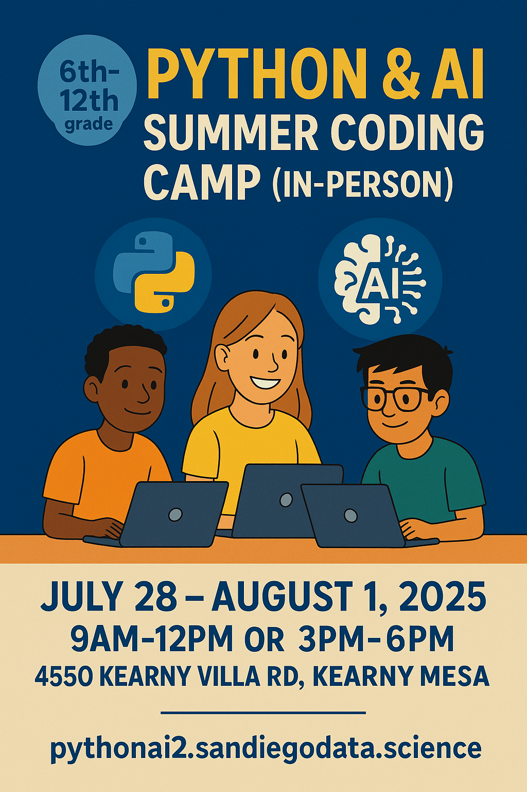

---
categories:
- python
date: '2025-05-18'
layout: post
title: Python and AI Coding Summer Camp in person in San Diego
---

I'm excited to announce that I'll be teaching a brand new **Python and AI Coding Summer Camp** in person in San Diego, hosted at the Italian School of San Diego (Kearny Mesa)!

As someone deeply inspired by the rapid advances in AI, I want to be part of this exciting shift by teaching the next generation of coders and innovators.

For more information and to enroll, visit the [Python & AI Camp Enrollment Page](https://pythonai2.sandiegodata.science/).

**About the Program:**

- Designed for Middle and High School students, with no prior programming experience required
- Dates: Monday, July 28 to Friday, August 1, 2025.
- Flexible schedule: Morning (9am–12pm, Mon/Wed/Thu/Fri) or Afternoon (3pm–6pm, Mon/Tue/Wed/Thu) options.
- Hands-on, project-based learning: students will build a text-based game in Python, then enhance it with AI-powered features.
- Direct interaction with cutting-edge Large Language Models (LLMs) integrated into the curriculum.
- All activities are browser-based—just bring a laptop, no installation needed.
- We actively encourage students from underrepresented genders and communities in tech to join us. Our camp is designed to be supportive and inclusive for all.

